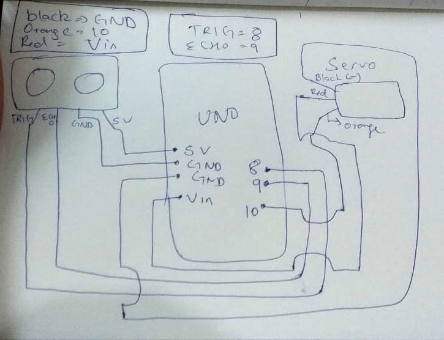
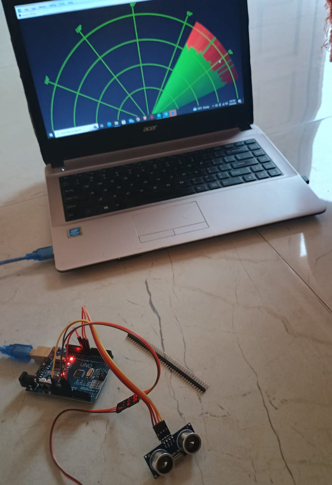

# Radar-Using-Arduino-Uno-Ultrasonic-Sensor

The Arduino Uno R3 Compatible Board is a microcontroller board that is based on the ATmega328. Arduino Uno has 14 digital input or output pins(where 6 can be used as PWM outputs), 6 analog inputs, a 16 MHz ceramic resonator, a USB connection, a power jack, an ICSP header, and a reset button. It has everything needed to support the microcontroller, you need to simply connect it to a computer with a USB cable or power it with an AC-to-DC adapter or battery to get started.

This HC-SR04-Ultrasonic Distance Measuring Sensor is a very popular sensor that is found in many applications where it requires measuring distance and detecting objects. The HC-SR04 ultrasonic sensor uses sonar to determine the distance to an object like bats or dolphins do. The module has two eyes-like projects in the front which form the Ultrasonic transmitter and Receiver.  

The Micro Servo 9G is lightweight, high-quality, and lightning-fast. The servo is designed to work with almost all radio control systems. It is with excellent performance that brings you to another horizon of flight.

This is the combo of 20CM Wire Color Jumper Cable, M-M, M-F, F-F 10PCS of wire in each strip of cable. It is very flexible and easily detachable to no. of wires to your requirement. Mostly it can be used for Orange Pi, Banana Pi, Raspberry Pi, Arduino, and other mini PC and development boards.

1 x Arduino Uno R3 SMD Compatible Development Board with Cable

1 x Ultrasonic Module HC-SR04 Distance Measuring Sensor

1 x Tower Pro 9G Micro Servo Motor

1 x Combo of 3 type Jumper Cables | F-F | F-M | M-M

# Circuit Diagram

